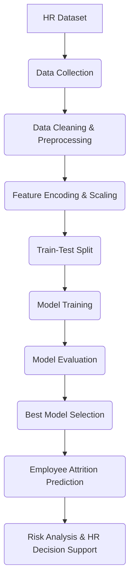

# Employee Attrition Prediction Using Human Resource Data Analytics

## 📖 Overview

**Employee Attrition Prediction Using Human Resource Data Analytics** is a Machine Learning-based system designed to predict whether an employee is likely to leave an organization. The project analyzes historical HR data such as employee demographics, job role, tenure, performance, compensation, work-life balance, overtime, and satisfaction levels to identify employees at risk of attrition.

The primary goal is to help Human Resource departments make proactive, data-driven decisions that improve employee retention, reduce recruitment costs, and enhance organizational productivity.

---

## ⚠️ Problem Statement

Employee attrition is a major challenge for organizations, leading to increased hiring costs, productivity loss, and disruption of business operations. Most companies react only after an employee resigns rather than identifying potential risks beforehand.

This project aims to develop a predictive system that can accurately identify employees who are likely to leave, allowing HR teams to implement targeted retention strategies.

---

## 🎯 Objectives

- Predict employee attrition using historical HR data.
- Identify the key factors influencing employee turnover.
- Compare multiple Machine Learning algorithms for prediction.
- Select the best-performing model based on evaluation metrics.
- Provide actionable insights for HR decision-making.

---

## ✨ Features

- **Employee attrition prediction:** (Stay or Leave)
- **Data preprocessing and cleaning:** Handling missing values and outliers
- **Categorical feature encoding:** Transforming text data into numerical
- **Feature scaling and selection:** Optimizing model performance
- **Multiple ML model comparison:** Finding the best fit
- **Employee risk scoring:** Identifying high-risk individuals
- **Feature importance analysis:** Understanding key drivers
- **HR decision support:** Through visualizations and reports

---

## 📊 Dataset

The project uses an HR Analytics dataset containing employee information such as:

- Age
- Department
- Job Role
- Monthly Income
- Years at Company
- Performance Rating
- Work-Life Balance
- Overtime Status
- Job Satisfaction
- Education
- Marital Status
- Attrition (Target Variable)

---

## 🤖 Machine Learning Models Used

The project compares multiple classification algorithms:

1. **Logistic Regression**
2. **Decision Tree**
3. **Random Forest**

The models are evaluated using:

- Accuracy
- Precision
- Recall
- F1 Score

---

## 🔄 Project Workflow

---

## 🛠️ Technologies Used

- **Language:** Python
- **Data Manipulation:** Pandas, NumPy
- **Machine Learning:** Scikit-learn
- **Visualization:** Matplotlib, Seaborn
- **Model Serialization:** Joblib

---

## 📈 Evaluation Metrics

The models are evaluated using the following metrics:

- Accuracy
- Precision
- Recall
- F1 Score
- Confusion Matrix
- ROC-AUC Analysis

---

## 🏆 Results

The performance of the Machine Learning models is summarized below:

| Model | Accuracy | Precision | Recall | F1 Score |
| :--- | :--- | :--- | :--- | :--- |
| **Logistic Regression** | 75.2% | 36.9% | 76.6% | 49.7% |
| **Decision Tree** | 65.6% | 22.0% | 46.8% | 30.3% |
| **Random Forest** | 84.0% | 50.0% | 38.3% | 43.4% |

### Best Model

> **Random Forest** achieved the highest overall **Accuracy of 84.0%**, making it the most reliable model for employee attrition prediction in this project.

*Although Logistic Regression achieved the highest Recall (76.6%) and F1 Score (49.7%), Random Forest demonstrated better overall classification performance and generalization capability.*

---

## 💡 Expected Outcome

The system predicts employees who are at risk of leaving the organization and provides insights into the factors influencing attrition. This enables HR teams to implement proactive retention strategies, improve workforce stability, and reduce the financial impact of employee turnover.

---

## 💼 Applications

- Human Resource Analytics
- Employee Retention Strategy
- Workforce Planning
- Talent Management
- Organizational Decision Support

---

## 🚀 Future Enhancements

- Real-time employee monitoring
- Explainable AI (XAI) for prediction interpretation
- Deep Learning-based prediction models
- Class imbalance handling using SMOTE
- Interactive web dashboard for HR managers

---

  <b>Built with ❤️ by Rohan, Nikhil, Yogeshwar</b>

